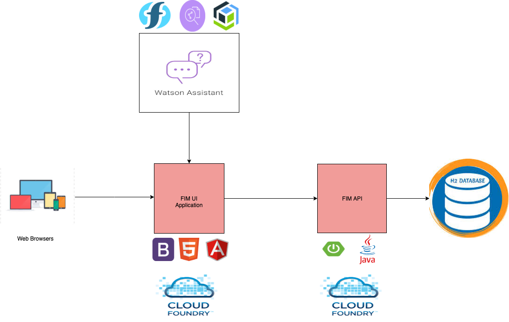

# Fortune In Misfortune (FIM)
FIM is an our solution bridge the gap and make sure the Needy is having one stop place to seek for the help 
The Government / NGO team will explore the requests and ensure the assistance.

### Tech Stack:
- Angular 9
- Bootstrap
- HTML
- IBM Watson Assistant
- IBM Cloud Foundry

### The architecture


1. The user navigates to the site http://wit-ui.eu-gb.mybluemix.net and registers with his Ration Card Number and other basic details.
2. User can connect with FIM Assistant and ask queries.
3. User can now login to the FIM Application with his credentials.
4. User can place a order for food packets. He can place a order once in 10 days.## Project roadmap

### Roadmap:
- Authentication upon placing/ receiving the orders
- Placing orders through Voice commands
- Enable the Chat assistant with Dynamic queries like order tracking
- Enable voice integration in the Chat Assistant
- Enable it for all cities in India
- Enable it for NGOs and individual contributors
- Enable it for Medicines delivery (upon prescription)

### Getting started

These instructions will get you a copy of the project up and running on your local machine for development and testing purposes.

### Prerequisites
What things you need to install the software and how to install them. 
- Node v12.16.2
- FIM has been integrated with a backend API which can be found at https://github.com/Mansi-Jain/WiT-Hackathon-2020-API

### Local Development
Fork and clone the repo to get started
```bash
git clone https://github.com/Mansi-Jain/WiT-Hackathon-UI/
```
Install the packages:
```bash
npm install
```
Build the application and run the unit tests:
```bash
npm test
```

### Steps to run FIM-UI locally
```bash
npm start
```
Navigate to http://localhost:4200/. The app will automatically reload if you change any of the source files.


